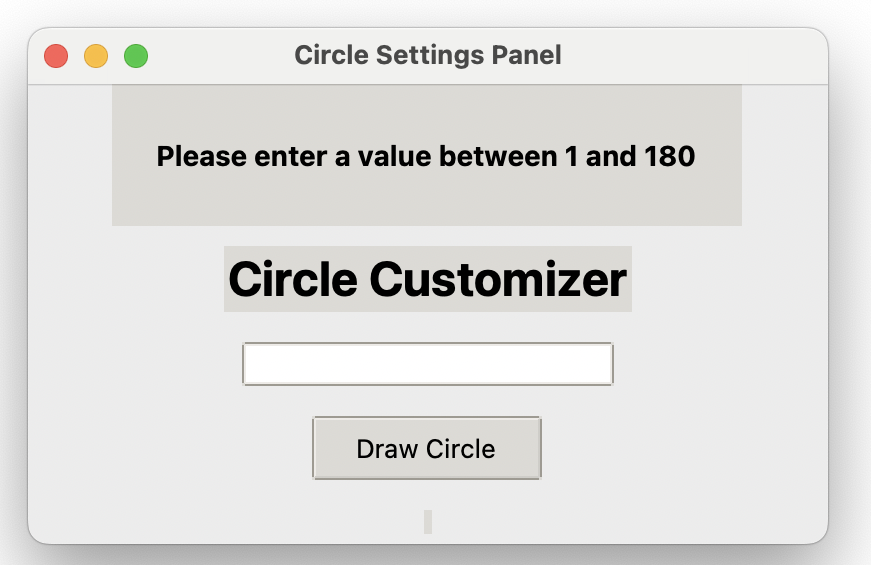

# 🎨 Circle Customizer

## ✨  Description

**Circle Customizer** is a fun, easy-to-use Python application that merges Tkinter's simple graphical user interface with the creative power of Turtle graphics. Enter your preferred rotation increment and instantly generate beautiful, vibrant circle patterns!

Simply choose the degree increments, click a button, and watch as mesmerizing, colorful artwork unfolds on your screen!

## 🚀 Features
- 🌈 **Interactive GUI**: User-friendly interface crafted with Tkinter.
- ⚙️ **Customizable**: Enter your desired degrees of rotation to personalize your design.
- 🎲 **Randomized Colors**: Every creation features randomly generated RGB colors, ensuring each pattern is unique.
- ✅ **Easy to Use**: Effortlessly create stunning patterns with just a few clicks.

## 📸 Demo





## 🔧 Requirements
- Python 3.x
- Standard Python libraries: `turtle`, `tkinter`, and `random` (all included in standard Python distribution)

## 🚦 How to Run

1. Clone this repository or download the files.
2. Run the Python script in your terminal:

```bash
python circle_customizer.py
```

3. Input your preferred rotation increment and enjoy your custom artwork!

## 🎈 Example
- **Input**: `5`
- **Output**: Generates circles rotating 5 degrees at a time, creating a symmetrical and vibrant pattern.

---

🎉 **Enjoy creating colorful masterpieces effortlessly!**
